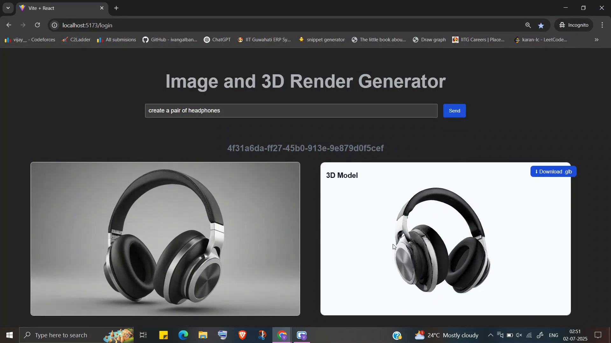

# OpenFabric POWERED text-to-3Drender Generating Agent


This Projet implements a modular, extensible agent framework that integrates openFabric powered text-to-image and image-to-3dmodel models with  LLMs (like Gemini and Ollama) , memory, content generation, and task processing capabilities. It supports multi-session interactions and acts based on natural language instructions.

- The Agent Leverages Processor to execute tasks which is based on  [Finite State Machine](./Documentation/Processor_State_Machine.md) Atchitecture.
---

## 🚀 Key Features

- ✅ **Session Management**: Create/resume sessions with persistent memory  
- 🤖 **Pluggable LLMs**: Easily switch between Gemini and Ollama  
- 🧠 **Semantic Recall**: Retrieve similar past sessions using pgvector  
- 🖼️ **Image Generation**: Text-to-image via custom generator API  
- 🔧 **Processor FSM**: Declarative command execution via state-based interpretation  

---


## 🧩 Component Summary

| Component        | Responsibility                               |
|------------------|----------------------------------------------|
| `Agent`          | Core orchestrator of LLM, session, processor |
| `Processor`      | Parses LLM response JSON and executes state  |
| `SessionManager` | Manages sessions in memory and DB            |
| `Generator`      | Image/3DModel content generation (abstract)  |
| `VectorDB`       | Unified access to vector DB + document DB    |
| `PromptManager`  | Loads static prompt templates                |

---

More Details in [Documentation](./Documentation/)


## 📌 Setup Instructions for project

1. Clone the repository:


```bash
git clone https://github.com/VIJAY-0/OpenFabric-APP
cd OpenFabric-App

```

2. Start PostgreSQL and MongoDB (via Docker Compose)

```bash
cd APP/app

## at APP/app

# Create network for DB communication
docker network create myapp-net

# Start the Postgress Database and Mongo Database first
docker compose up -d  


```

3. Build and Run app (via Docker File)

```bash
## at APP/app

# Build the app image

docker build -t newapp .
# Start the app in a container named myapp
docker run -p 8888:8888  --network=myapp-net --name myapp newapp

```

4. Test using Browser frontend
## at APP/app

```bash
## at Frontend/

npm install 
npm run dev

```
5. Acess the app at
 
 `http://localhost:5173/`

This is how the app looks



### 🚀 Request Schema

```json
{
    "pompt":"",
    "attachments":[],
    "session_id":""
}
```

- Session id is empty for a new sesion.
- once first request is made , response contains a session id. 
- each request needs to add the same session id for entire conversaton to maintain contxt.


## 🚀 Response Schema

```json
{
    "message":"",
    "image":"",
    "object":"",
    "session_id":""
}

```
- message is response text from the app
- image is a base64 encode image in string format
- object is a base64 encode image in string format
- sesion_id is a uuid in string format


---

## 🧠 LLM Interface

Implemented via an abstract `LLM` class. Includes:

- Message history  
- Streaming and non-streaming calls  
- Prompt templating via `PromptManager`

Supports:

- `GeminiLLM`  
- `OllamaLLM`  

set this in APP/app/.env 

```bash
    BASE_LLM=gemini
```
or 

```bash
    BASE_LLM=lamma3.1:1b
```

---
